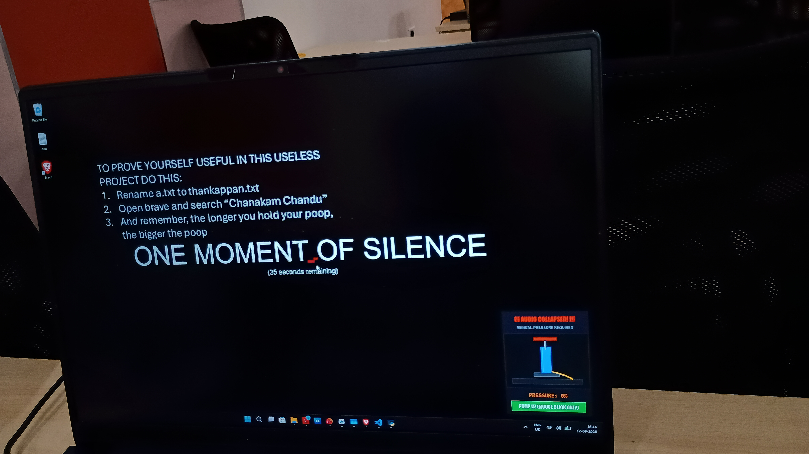
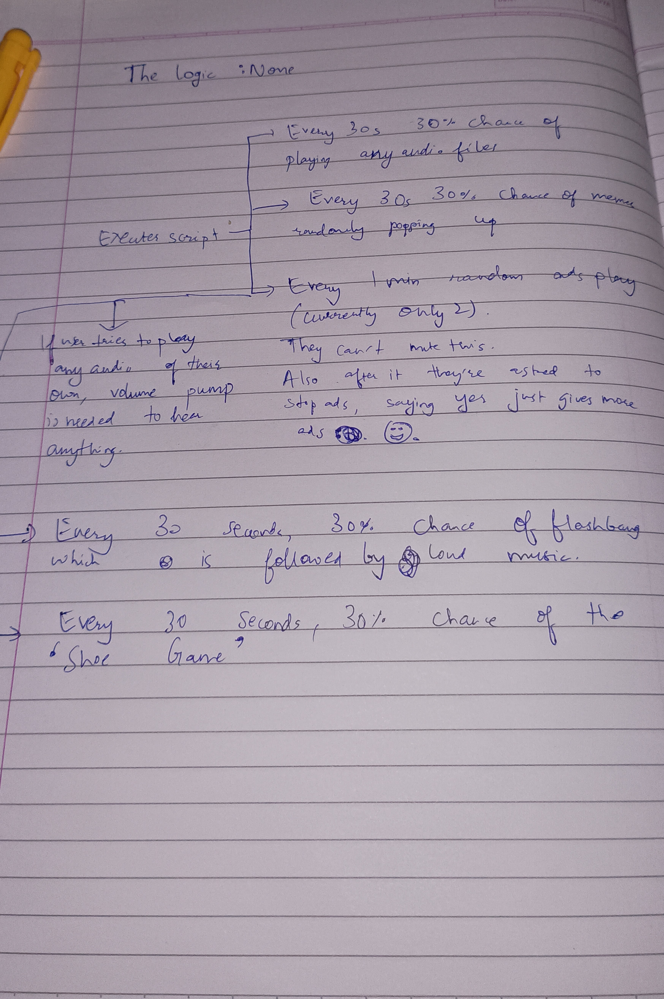

# Randomly Assembled Garbage 😘


## Basic Details
### Team Name: RAG


### Team Members
- Team lead: Abban C Varughese - College of Engineering Trivandrum
- Member 2: Joseph Jayan - College of Engineering Trivandrum

### Project Description
We're just sitting here and don't have anything else to do, so why not make life a bit more chaotic?

### The Problem (that doesn't exist)
Computers work too reliably and peacefully. Life is too quiet, smooth, and predictable.

### The Solution (that nobody asked for)
Randomly Assembled Garbage (RAG): An unhinged Windows daemon featuring: \
\
the meaning of our exisence
1. **Audio Collapse & Manual Bicycle Pump**: Detects whenever audio is playing on your PC. Rolls an 80% random chance to drop the system volume immediately to 0. Forces you to frantically click a bicycle pump in the bottom-right corner to manually pump sound back to 100%, fighting diminishing returns and continuous pressure decay.
2. **Flashbang Hazard**: Every 60 seconds, rolls a 60% chance to blind the screen with a full-screen whiteout and a cinematic BOOM explosion with fading tinnitus ring. Extensible architecture allows easily registering future hazards.
3. **Mouse Stamina Bar**: Mouse has physical stamina displayed by a high-contrast floating bar directly above the cursor (White -> Orange -> Red). Moving depletes stamina; stopping regenerates it. If depleted to 0%, the mouse enters **"ONE MOMENT OF SILENCE"** where the cursor and all Windows gestures are completely frozen for 60 seconds with "RIP" on the bar and giant raw Arial 72 text on screen.
4. **Keyboard Scrambler**: 40% of the time while typing, the typed letter is randomly swapped with an adjacent QWERTY key (e.g., typing `g` produces `h` or a neighboring letter).
5. **LOVE IS ALL**: PLETHORA OF OTHER FEAUTURES CHECK IT OUT YOURSELF YOU LAZY IDIOT!
6. **Emergency Failsafe**: Press `F8` or `Ctrl + Shift + Q` anywhere, anytime to safely restore mouse speed, unfreeze cursor, restore audio, and exit cleanly.
\
You might be wondering, why do we hate our lives so much and why we would want anyone to subject ourselves and you to this torture? \
To that we say, welcome to computer science, where we make stuff up for the sake of it

## Technical Details
### Technologies/Components Used

- **Languages**: Python 3.14
- **Windows APIs**:
  - `ctypes` COM interfaces (`IMMDeviceEnumerator`, `IAudioEndpointVolume`, `IAudioMeterInformation`) for zero-dependency native Windows Core Audio control.
  - `user32.SystemParametersInfoW` (`SPI_SETMOUSESPEED`) for native cursor throttling.
  - `win32gui` / `win32con` extended window styles (`WS_EX_TRANSPARENT`, `WS_EX_LAYERED`, `WS_EX_TOOLWINDOW`, `WS_EX_NOACTIVATE`) for click-through floating cursor HUD.
- **GUI Framework**: Tkinter (custom canvas rendering and procedural alpha animations)
- **Audio Synthesizer**: Pure standard library procedural WAV generator (`wave`, `struct`, `math`) for offline sound effects (Explosion BOOM, air pump hiss, victory chime).
-- **Unique value**: Probably the first 12 hour useless project to have deprecated features that still exist in the code but weren't used.
### Implementation

# Installation
```powershell
git clone <repo-url>
cd useless_project
pip install -r requirements.txt
```

# Run
```powershell
# Double click run.bat OR:
python main.py
```

### Project Documentation

# Screenshots (Add at least 3)

*The least that can happen*

# Diagrams

*Wow, it must be so complex*

### Project Demo
# Video
[Woww](https://photos.app.goo.gl/XsqRXqvrqB6nmSAr5)
*Chaos Unleashed*

### The actual chaos
[Watch if you dare](https://drive.google.com/file/d/1aV0_LQH1FvuLMJh_kVgk5oUt7b_-T5XC/view?usp=sharing)
---
Made with ❤️ at TinkerHub Useless Projects 


